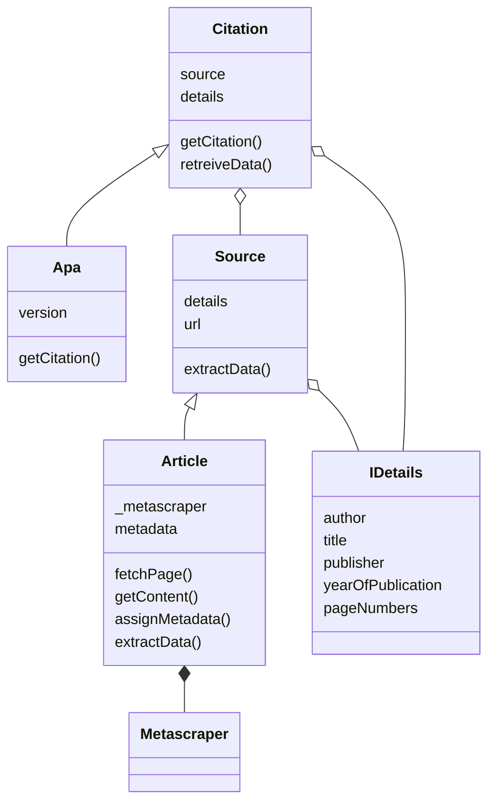

# Citation Generation API

## Summary

This is a Node API to generate citations automatically. Right now it only supports APA 7 citations. 
Support for MLA and BibTex citations can be added by creating more classes and making them child classes of 
`Citation` class.

We have utilized an Object-Oriented Architecture to separate everything and minimize coupling and maximize cohesion for a great design. 

Here is the Unified Modelling Language (UML) diagram for the models:



This API uses `metascraper` to extract the data about websites. Credits: [Metascraper](https://metascraper.js.org/)

### Input

Right now a **POST** request can be sent to the endpoint `/api/citation/article`. 
The body is as follows:
```json
{
    "url": "https://doi.org/10.1007/s10639-021-10650-9"
}
```

### Output

The output will be provided as follows:

```json
{
    "citation": "Alaattin Parlakkiliç (2021-07-12T00:00:00.000Z), Evaluating the effects of responsive design on the usability of academic websites in the pandemic - Education and Information Technologies, SpringerLink, https://doi.org/10.1007/s10639-021-10650-9"
}
```

It's not perfect right now, and might return null values for some stuff so it needs to be fixed. 
Please contribute to this repository to improve the code. 
